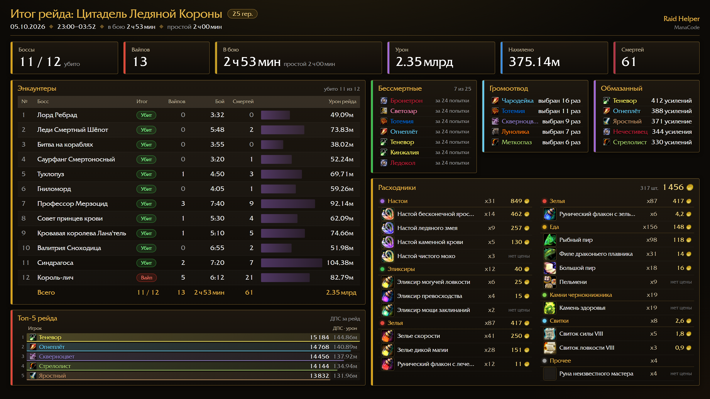
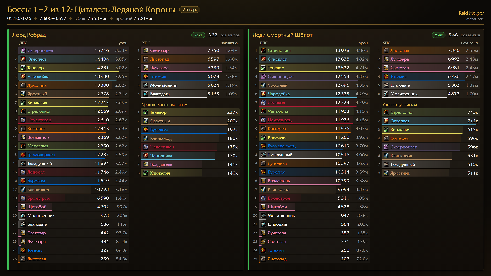

# [MANACODE] Raid Helper

**Raid review from the combat log and raid gathering by template — for WoW 3.3.5a (Wrath of the Lich King).**

Raid Helper records your raid and turns it into answers: who died and why, who stood in what, who did the mechanics, how much damage went where — attempt by attempt and for the whole raid night. Then it shows the fight again as a 3D replay and posts the results to your guild's Discord.

[Download (latest release)](https://github.com/dmitriinosach/-MANACODE-RaidHelper/releases) · [ManacodeUpdate — installer and updater](https://github.com/dmitriinosach/-MANACODE-Update/releases/latest) · [Discord](https://discord.gg/CYnxS6R9qY)

---

## Features

### Attempt review
- **Attempt summary** — result, raid DPS/HPS (damage ÷ attempt duration, like the server), deaths, boss mechanics as compact tables: damage to adds and Val'kyr, debuffs stacked, puddles, interrupts.
- **Deaths with causes** — the last hits before each death, defensives that were ready, the wave of deaths at the end of a wipe.
- **Timeline and threat** — every player's casts, buffs and damage on one strip; threat on the tank.
- **3D replay** — the fight played back on the boss room floor: player figures, boss and adds, mechanics on the floor (Defile, Remorseless Winter, Halion's two realms, Lana'thel's shadows), class effects; pause, rewind, speeds x0.5–x8.

### Raid night
- **Raid summary** — bosses killed, wipes, time in combat vs idle, total damage and healing, top-5 of the raid.
- **Raid badges** — damage to important targets, Saver (interrupts and dispels), Immortals, first to die, the raid's main mistake, Puddle lover, Lightning rod (most picked by bosses), Buffed (most Tricks / Power Infusion / Hysteria received).
- **Consumables** — flasks, potions, food per player and the cost of the raid in gold.
- **Discord** — one click sends the raid result as 4K images (raid summary + every boss with all DPS, healers and the key target) to your channel via ManacodeUpdate.

### Loot and penalties (GP)
- **Fault list** — mechanics mistakes per attempt with proof, ready to award GP / deduct EP / spend DKP (EPGP, Quick DKP V2).
- Rules, presets, hotkeys for Slack / Death / Wipe, a journal with undo.

### Raid gathering
- **Raid tab** — pick a template and the raid slots are laid out by groups; who is missing, specs vs the template, expected raid DPS from the player database.
- **Buff check** — on ready check the raid tab highlights who lacks raid buffs, flask, food or personal buffs; one button posts "who should buff whom".
- **Auto-invite** — "+" (or your words) in whispers or guild chat; up to 40 with a queue when the raid is full.
- **Raid commands** — breaks, pull timers, difficulty, marks.

### Always at hand
- **Mini window** — Fault list / DPS / HPS / Targets; DPS during combat like Skada, the fault list after it; pick any attempt from a list; report to chat.
- **Panel** — live DPS/HPS graphs, consumables of the raid (who needs to refresh), CPU load.

## Screenshots

## Install

1. **ManacodeUpdate** (recommended): download it from [its releases](https://github.com/dmitriinosach/-MANACODE-Update/releases/latest), run it, press **Установить / Обновить** (Install / Update) for Raid Helper. 3D rooms for the replay — **3D-залы реплея → Применить** (3D replay rooms → Apply).
2. **Manually**: download `ManaCode_RaidHelper-v….zip` (full, with 3D rooms) or `…-lite-v….zip` (without rooms) from [Releases](https://github.com/dmitriinosach/-MANACODE-RaidHelper/releases), unpack into `Interface\AddOns`, restart the game client completely.

Open the window with `/mrh` or the panel buttons. Interface languages: English and Russian.

---

# [MANACODE] Raid Helper — по-русски

**Разбор рейда по боевому логу и сбор состава по шаблону — для WoW 3.3.5a (Wrath of the Lich King).**

Raid Helper записывает рейд и отвечает на вопросы: кто умер и почему, кто где стоял, кто сделал механики, сколько урона ушло куда — по каждой попытке и за весь вечер. Потом показывает бой заново в 3D-реплее и выкладывает итоги в Discord гильдии.

[Скачать (последний релиз)](https://github.com/dmitriinosach/-MANACODE-RaidHelper/releases) · [ManacodeUpdate — установка и обновление](https://github.com/dmitriinosach/-MANACODE-Update/releases/latest) · [Discord](https://discord.gg/CYnxS6R9qY)

## Возможности

### Разбор попытки
- **Сводка попытки** — итог, ДПС и ХПС рейда (урон ÷ длительность попытки, как у сервера), смерти, механики босса компактными таблицами: урон по аддам и валькирам, набранные стаки, лужи, сбития.
- **Смерти с причинами** — последние удары перед смертью, какие защитные были готовы, волна смертей в конце вайпа.
- **Таймлайн и угроза** — касты, бафы и урон каждого на одной полосе; угроза на танке.
- **3D-реплей** — бой заново на полу зала: фигурки игроков, босс и адды, механики на полу (Осквернение, Беспощадная зима, два мира Халиона, тени Ланатель), классовые эффекты; пауза, перемотка, скорость x0,5–x8.

### Рейдовый вечер
- **Сводка рейда** — убито боссов, вайпы, время в бою и простой, урон и лечение, топ-5 рейда.
- **Бейджи рейда** — урон по важным целям, Спасатель (сбития и снятия), Бессмертные, умирал первым, главный косяк рейда, Любитель луж, Громоотвод (кого чаще выбирали боссы), Обмазанный (больше всех Хитростей, Придания сил и Истерии).
- **Расходники** — банки, зелья, еда по игрокам и стоимость рейда в золоте.
- **Discord** — одной кнопкой итог рейда уходит в канал картинками в 4K (сводка рейда и каждый босс: все ДПС, хилы, важная цель) через ManacodeUpdate.

### Косячница (ГП)
- **Косяки** — ошибки на механиках по попыткам с пруфом, сразу к начислению ГП / снятию ЕП / ДКП (EPGP, Quick DKP V2).
- Правила, пресеты, хоткеи Слак / Смерть / Вайп, журнал с отменой.

### Сбор рейда
- **Вкладка «Рейд»** — выбрал шаблон, и слоты рейда разложены по группам; кого не хватает, спеки против шаблона, ожидаемый ДПС рейда по базе игроков.
- **Проверка бафов** — на проверке готовности подсвечивает, у кого нет рейдовых бафов, фласки, еды или своих бафов; одной кнопкой в рейд — кто кого добафывает.
- **Автоинвайт** — «+» (или свои слова) в шёпот или в чат гильдии; до 40 и очередь, если рейд полон.
- **Команды рейда** — перерывы, пул, сложность, метки.

### Всегда под рукой
- **Мини-окно** — Косячница / ДПС / ХПС / Цели; в бою ДПС как в Skada, после боя — косяки; выбор попытки списком; отчёт в чат.
- **Панель** — графики ДПС/ХПС, банки рейда (кому обновить), нагрузка на ЦП.

## Скриншоты

См. выше: итог рейда и боссы в Discord.

## Установка

1. **ManacodeUpdate** (удобнее): скачать со [страницы релизов](https://github.com/dmitriinosach/-MANACODE-Update/releases/latest), запустить, у Raid Helper — **Установить / Обновить**. 3D-залы для реплея — **3D-залы реплея → Применить**.
2. **Вручную**: скачать `ManaCode_RaidHelper-v….zip` (полный, с 3D-залами) или `…-lite-v….zip` (без залов) в [Releases](https://github.com/dmitriinosach/-MANACODE-RaidHelper/releases), распаковать в `Interface\AddOns`, полностью перезапустить клиент.

Окно — `/mrh` или кнопки на панели. Язык интерфейса — русский и английский.
